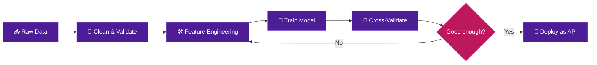

<div align="center">

<!-- 1. Custom animated hero (assets/hero.svg): pulsing neural net + ECG signal line -->


<!-- 2. Typing animation -->
<a href="https://github.com/Anumishra02">
  
</a>

<br/>

<!-- 3. Live badges -->


<br/><br/>

<a href="https://anumishra.vercel.app"></a>
<a href="https://www.linkedin.com/in/anumish/"></a>
<a href="mailto:anumishra555555@gmail.com"></a>
<!-- <a href="YOUR_RESUME_LINK"></a> -->

</div>


## 👋 Hey, I'm Anu

I'm an **Electronics Engineering undergrad (CGPA 8.41) who fell for data science**, and I'm currently an **AI/ML Research Intern at HCL Technologies**, training deep learning models on **biomedical signals**.

I like the full loop: messy data → clean features → a model I can defend with the right metrics → something people can actually use.

```python
class AnuMishra:
    def __init__(self):
        self.role      = "Data Science & ML Engineer in the making"
        self.background = ["Electronics Engineering", "Embedded C/C++", "Signal Processing"]
        self.daily     = ["Python", "Pandas", "NumPy", "scikit-learn", "PyTorch"]
        self.now       = "Deep learning on biomedical signals @ HCL"
        self.graduating = "June 2027"

    def philosophy(self):
        return "Measure first. Explain the result. Then ship it."

    def open_to(self):
        return ["Data Science internships", "ML Engineer roles", "Research collabs"]
```

<div align="center">

| 🔭 Now | 📚 Learning | 🎯 Next |
| :---: | :---: | :---: |
| Biomedical signal DL model (PyTorch) | LLMs, RAG & prompt engineering | End-to-end MLOps on Azure |
| ATSync (NLP + Gemini) | Advanced feature engineering | Open-source ML contributions |

</div>


## 📈 Numbers I'm Proud Of

<div align="center">


</div>

---

## 🧪 How I Work



<details>
<summary><b>🧠 Click to open my "new dataset" checklist</b></summary>

<br/>

1. **Understand the target.** What decision will this model support, and what does a wrong prediction cost?
2. **Audit the data.** Check types, units, missing values, duplicates and leakage.
3. **Clean the awkward columns.** In CarVal, mileage, engine and power arrived as text with units mixed in.
4. **Engineer features.** Derive things like *car age* and *km per year* instead of feeding raw columns.
5. **Baseline first.** Beat a simple model before reaching for a complex one.
6. **Validate honestly.** K-fold CV and a held-out set, plus error metrics a non-technical person can read.
7. **Explain, then ship.** Wrap it in an API and a UI so the result is usable.

</details>


## 🚀 Featured Projects

*Click a project to expand the case study.*

<details open>
<summary><b>🚗 CarVal — Used-Car Price Predictor</b> &nbsp;·&nbsp; <code>Gradient Boosting</code> <code>scikit-learn</code> <code>Flask</code></summary>

<br/>

A machine learning system that predicts used-car prices and compares them to the live market.

| | |
| --- | --- |
| **Data** | 6,019 listings across 11 cities, cleaned from raw mileage, engine and power fields |
| **Features** | Derived car age and kilometers per year; OneHotEncoder across 13 inputs |
| **Model** | `GradientBoostingRegressor` (500 estimators, depth 5, learning rate 0.05) |
| **Result** | **R² = 0.90** with 10-fold CV; **81%** of held-out predictions within ₹2L of the true price |
| **Deployment** | Flask backend with 4 API routes (auto-fill, market comparison), dark-themed live-price UI on Render, 30 brands and 1,800+ models |

[🔗 View on GitHub](https://github.com/Anumishra02/CarVal)

</details>

<details>
<summary><b>🧬 Biomedical Signal Analysis — HCL Technologies</b> &nbsp;·&nbsp; <code>PyTorch</code> <code>Pandas</code> <code>NumPy</code></summary>

<br/>

Research internship project (Jun 2026 – present).

- Built and trained a **PyTorch deep learning model** for biomedical signal analysis.
- Designed **custom loss functions and optimization strategies** tailored to the task.
- Led **signal preprocessing and feature engineering**, then evaluated performance across multiple metrics.
- Diagnosed performance bottlenecks and proposed **empirically backed architecture improvements**.

*Code stays private because it is part of an internship project.*

</details>

<details>
<summary><b>📄 ATSync — AI Resume Analyzer</b> &nbsp;·&nbsp; <code>NLP</code> <code>Gemini AI</code> <code>FastAPI</code> &nbsp;·&nbsp; <i>ongoing</i></summary>

<br/>

- Scores resumes against job descriptions using **NLP keyword extraction**, with a **45% improvement in match accuracy** in benchmark tests.
- Integrates **Google Gemini** for grammar analysis, interview-question generation and cover-letter drafting, **cutting manual effort by about 60%**.
- Async **FastAPI** services with PDF parsing and Pydantic validation, with **sub-300 ms** responses in local load tests.

[🔗 View on GitHub](https://github.com/Anumishra02/ATSync)

</details>

<details>
<summary><b>🧑‍💻 CodeSense AI — AI Code Reviewer</b> &nbsp;·&nbsp; <code>Gemini AI</code> <code>Node.js</code> <code>React</code></summary>

<br/>

An LLM-assisted code-review tool that generates improvement suggestions, cutting manual review workload by about 40%, with REST APIs responding in under 250 ms.

[🔗 View on GitHub](https://github.com/Anumishra02/CodeSense-AI)

</details>

<div align="center">
<a href="https://github.com/Anumishra02/CodeSense-AI"></a>
</div>


## ⚙️ Tech Stack

### 🐍 Languages


### 📊 Data Science & Analysis


### 🤖 Machine Learning & Deep Learning


### ✨ Generative AI


### 🚀 Deployment & Tools


### 🔌 Embedded & Signals (my Electronics roots)


<details>
<summary><b>🔭 Currently exploring</b></summary>

<br/>


</details>

<details>
<summary><b>🌐 Also comfortable with (web)</b></summary>

<br/>


</details>


## 🎓 Education, Certifications & Wins

| | |
| --- | --- |
| 🎓 **B.Tech, Electronics Engineering** | Kamla Nehru Institute of Technology · CGPA **8.41** · Expected June 2027 |
| 🏅 **Microsoft AI & ML Engineering** | Supervised, unsupervised & deep learning; MLOps on Azure |
| 🏅 **Oracle Foundations in AI** | Machine learning and ethical AI |
| 🏅 **IBM Back-End Development** | Node.js and Express applications |
| 🏆 **Smart India Hackathon** | Qualified among 50+ teams |

---

## 📊 GitHub Analytics

<div align="center">


</div>

### 🐍 Contribution Snake

<div align="center">
  <picture>
    <source media="(prefers-color-scheme: dark)" srcset="https://raw.githubusercontent.com/Anumishra02/Anumishra02/output/github-contribution-grid-snake-dark.svg" />
    <source media="(prefers-color-scheme: light)" srcset="https://raw.githubusercontent.com/Anumishra02/Anumishra02/output/github-contribution-grid-snake.svg" />
    
  </picture>
</div>


## 🛣️ Roadmap 2026–27

- [x] Train and deploy an end-to-end ML model (CarVal)
- [x] Start a research internship in deep learning (HCL)
- [x] Earn the Microsoft AI & ML Engineering certificate
- [ ] Publish 3 data-science case studies with notebooks
- [ ] Build a RAG project end-to-end
- [ ] Compete in a Kaggle competition
- [ ] Convert the internship into a full-time ML role

---

## 🎲 Just for Fun

<div align="center">

<br/>

<br/><sub>↻ Refresh the page for a new quote and joke</sub>
</div>

---

<div align="center">

### ☕ Have a dataset, a problem or an opportunity? Let's talk.

<a href="mailto:anumishra555555@gmail.com"></a>
<a href="https://www.linkedin.com/in/anumish/"></a>


</div>
